# Analog-to-Analog Latency on a Raspberry Pi 5 with the Waveshare High-Precision AD/DA Board

**Date of measurement:** 2026-05-22
**Author:** Rico Picone (with Claude Code assist)
**Project:** [`latency-experiment`](./README.md)

---

## 1. Summary

This experiment evaluates the Raspberry Pi 5 as a low-latency analog-I/O
host for the real-time computing textbook. The measurement is the end-to-end
delay from an analog input on an ADC to the corresponding analog output on
a DAC — the latency budget a control loop has to live within.

A closed-loop analog passthrough — function-generator sine → ADS1256 (24-bit
sigma-delta ADC) → user-space C loop on the Pi 5 → DAC8552 (16-bit DAC) —
was characterized on a Raspberry Pi 5 (Debian 13 trixie, kernel
`6.12.47+rpt-rpi-2712`) carrying the Waveshare High-Precision AD/DA Board,
a Hardware-Attached-on-Top (HAT) module that mounts on the Pi's 40-pin
header. The end-to-end analog-to-analog latency measured on a Tektronix
DPO2012B oscilloscope is

> **212.3 µs ± 4.8 µs** (mean ± s.d., n = 10 frequencies between 100 Hz and 1 kHz)

The system behaves as a pure transport delay: phase shift scales linearly
with frequency over the measured range (Fig. 1, panel a), and the
per-frequency delay computed from each phase reading is constant within
the measurement noise (panel b).

The Raspberry Pi 5 + user-space C loop (the part of the system that lives
in software) contributes **48.0 µs** of the budget — about **22%** — and
the **ADS1256's SINC5 decimation filter** (a fifth-order sinc filter
inside the ADC, see §4.3) is the dominant contributor at about **78%**.

The 22% software figure is worth a footnote, because it is *not* set by Pi
5 silicon. Of those 48 µs, only ~14 µs is irreducible SPI bit-clocking on
the wire; the other ~34 µs is the cost of the kernel-mediated `spidev` and
GPIO uAPI v2 interfaces the loop uses to talk to the SPI controller and the
chip-select pins. A direct-register-access loop — using `mmap` of the Pi
5's RP1 I/O controller's GPIO and SPI peripheral registers — would cut
that 48 µs to ~15 µs, at the cost of code that's specific to the RP1 chip
rather than portable across single-board computers (SBCs). See §5.5 for
the full set of trade-offs.

A "phase shift ≤ 1/20 of the signal period" criterion is met only up to
**≈ 238 Hz** on this hardware. (See §4.4 for what this criterion is and
why it is a useful yardstick for control-loop work.)

The headline figure is reproduced below:

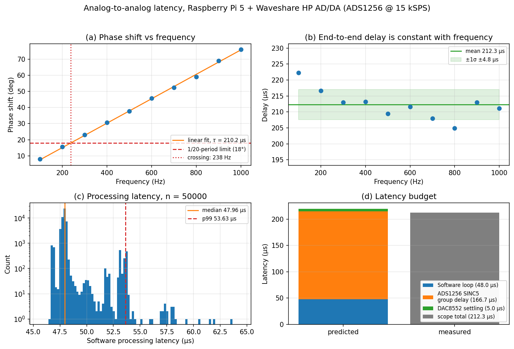

The same result on the scope at 500 Hz:

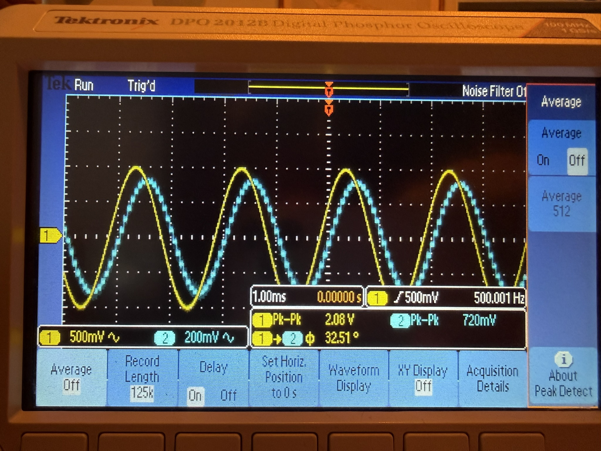

Block diagram of the signal path:

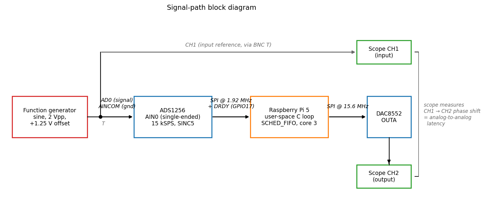

---

## 2. Setup

**Hardware**

| Item | Detail |
|---|---|
| SBC | Raspberry Pi 5 (BCM2712, RP1 I/O controller) |
| OS / kernel | Debian 13 (trixie) / `6.12.47+rpt-rpi-2712`, stock — no `PREEMPT_RT`, no `isolcpus` |
| ADC + DAC | Waveshare *High-Precision AD/DA Board* — TI ADS1256 (24-bit ΣΔ) + TI DAC8552 (16-bit) |
| Function generator | Sine, 2 Vpp, +1.25 V DC offset (signal swing 0.25 V → 2.25 V, within the ADS1256's `AIN0 ∈ [0, AVDD]` range) |
| Oscilloscope | Tektronix DPO2012B; AC coupling on both channels; 512× waveform averaging; manual cursor / measurement readout (statistics off) |

**Software**

| Item | Detail |
|---|---|
| Loop | C, single-threaded, `SCHED_FIFO` priority 80, pinned to core 3, `mlockall(MCL_CURRENT \| MCL_FUTURE)` |
| GPIO | Linux GPIO character-device uAPI v2 (the legacy `bcm2835` / `wiringPi` libraries are incompatible with the RP1 controller) |
| SPI | `spidev`, per-transfer clock rate. ADS1256 clocked at 1.92 MHz (`f_CLKIN/4`, the part's hard ceiling); DAC8552 at 15.6 MHz |
| ADC mode | RDATAC (continuous-read) on a single channel — minimum per-sample overhead |
| Sample rate | 15 kSPS (`ADS1256_DRATE = 0xE0`) — see §5.2 for why not 30 kSPS |
| Chip select (CS) | Manual GPIO toggle. On a shared SPI bus each peripheral has its own CS line that the master drives low to address it. The Waveshare HAT wires both chips' CS pins to plain GPIO lines (GPIO22 for the ADC, GPIO23 for the DAC) rather than the SPI controller's built-in CE0/CE1 outputs, so the C loop toggles them itself rather than letting the controller do it. |

**Wiring**

| Signal | HAT terminal | Header pin / line |
|---|---|---|
| ADS1256 `AIN0` | `AD0` (screw block) | function-generator center |
| ADC analog ground | `AINCOM` / `AGND` | function-generator ground + scope CH1 ground |
| DAC8552 `OUTA` | `DAC0` (screw block) | scope CH2 |
| DAC analog ground | `AGND` near `DAC0` | scope CH2 ground |
| ADS1256 `DRDY` | — | GPIO17 (header pin 11), input |
| ADS1256 `RESET` | — | GPIO18 (pin 12), output |
| ADS1256 `CS` | — | GPIO22 (pin 15), output |
| DAC8552 `SYNC/CS` | — | GPIO23 (pin 16), output |
| SPI0 SCLK / MOSI / MISO | — | GPIO11 / 10 / 9 (pins 23 / 19 / 21) |

The function generator output was T-junctioned at the source: one leg drove
`AD0`, the other drove scope CH1 — making CH1 the *true input* and CH2 the
loop's output.

The HAT before wiring (note the `JMP_AGND` jumper position between `AINCOM`
and `AGND` — required for single-ended AIN0 / AINCOM operation), and after:

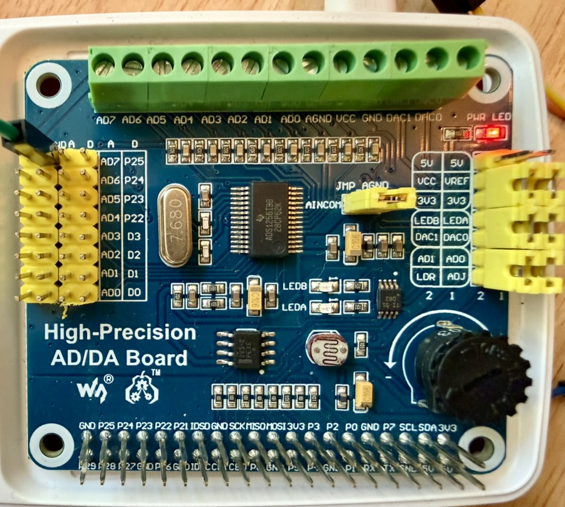

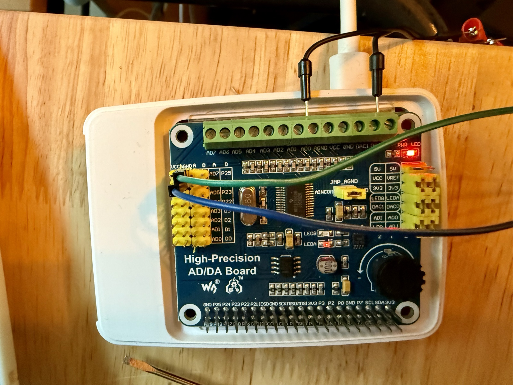

Function generator setup (Tektronix AFG1002): sine, 500 Hz, 2.000 Vpp,
+1.250 V DC offset. The waveform preview confirms the swing of 0.25 V →
2.25 V, well inside the ADS1256's `AIN0 ∈ [0, AVDD]` single-ended range.

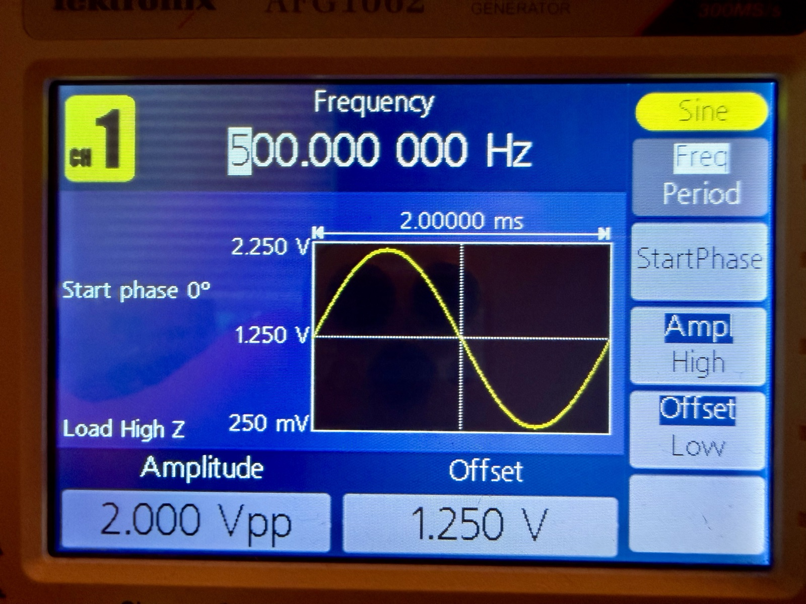

---

## 3. Methodology

### 3.1 Software timing (`characterize` mode)

The ADS1256 signals a freshly-converted sample by asserting its `DRDY` pin
(Data Ready) low. The C loop polls that GPIO and only reads the sample after
`DRDY` goes low, so every iteration is paced by the converter, not by the
CPU. The four timestamps recorded per iteration are:

```
ta : just before waiting for DRDY
tb : DRDY observed asserted (a fresh conversion is ready)
tc : 3-byte ADC sample read complete
td : 3-byte DAC write complete (the DAC output updates on CS-high)
```

From these it computes:

- `ADC read`     = `tc − tb`  (DRDY → ADC sample in memory)
- `DAC write`    = `td − tc`  (ADC sample → DAC chip written)
- `proc latency` = `td − tb`  (DRDY → DAC chip written; the headline software number)
- `loop period`  = `td − td_prev` (back-to-back iteration time)

Per-sample data was captured with `--csv` and analyzed off-line. The 50 000
samples used in this report come from a single `--mode characterize -n 50000`
run while the rig was idle (no function-generator input — the timing numbers
are independent of the analog signal; see §3.2).

### 3.2 Analog timing (scope sweep)

`latency_loop --mode passthrough` mirrors the ADC sample to the DAC output
continuously. With the function-generator sine on `AIN0`, the input-vs-output
phase shift on the scope (CH1 vs CH2) is the **true analog-to-analog
latency** — including the ADS1256's SINC5 filter *group delay* (the
time delay every frequency component picks up traversing the converter's
internal decimation filter; see §4.3) and the DAC8552's *settling time* (how
long the DAC output amplifier takes to swing to a new code's voltage),
neither of which the software loop can see.

Each phase reading was taken manually from the DPO2012B's built-in
"CH1→CH2 rising-edge delay" measurement, with 512× waveform averaging
enabled on both channels to smooth out random noise before the scope
computes the edge times. Scope statistics were left off; the displayed
delay value fluctuated by roughly half a degree during readout, and the
reported value is the eyeballed centre of that fluctuation.

Both channels used AC coupling. Because both channels see the same input
high-pass response, the contribution to phase is common-mode and cancels
in the channel-to-channel delta that defines the latency reading.

The level shift between input and output (CH1 swing 0.25–2.25 V, CH2 swing
~1.4–2.4 V) is the expected consequence of `Vref_ADC ≠ Vref_DAC` and the
mid-scale offset coded into the ADC→DAC value mapping. It does not affect
the phase measurement (the scope picks zero crossings from each channel
independently), so it does not affect the latency result.

The function-generator frequency was swept manually in 100 Hz steps from
100 Hz to 1 kHz.

---

## 4. Results

### 4.1 Frequency sweep (analog-to-analog latency)

Phase measurements and the corresponding time delays per frequency:

| Freq (Hz) | Phase (deg) | Delay (µs) |
|---:|---:|---:|
|  100 |  8.0 | 222.2 |
|  200 | 15.6 | 216.7 |
|  300 | 23.0 | 213.0 |
|  400 | 30.7 | 213.2 |
|  500 | 37.7 | 209.4 |
|  600 | 45.7 | 211.6 |
|  700 | 52.4 | 207.9 |
|  800 | 59.0 | 204.9 |
|  900 | 69.0 | 213.0 |
| 1000 | 76.0 | 211.1 |

**Mean delay = 212.3 µs, σ = 4.8 µs.** A linear fit of phase vs frequency
(forced through the origin) gives τ = 210.2 µs — within ~1% of the simple
mean. (The 100 Hz outlier, 222 µs, reflects the basic fact that converting
a *phase* reading back to a *delay* multiplies by the period: at 100 Hz the
period is 10 000 µs, so a ±0.5° readout uncertainty maps to ±14 µs of
delay uncertainty, while at 1 kHz the same ±0.5° maps to ±1.4 µs. The
high-frequency points are therefore individually more precise estimates of
the same underlying delay.)

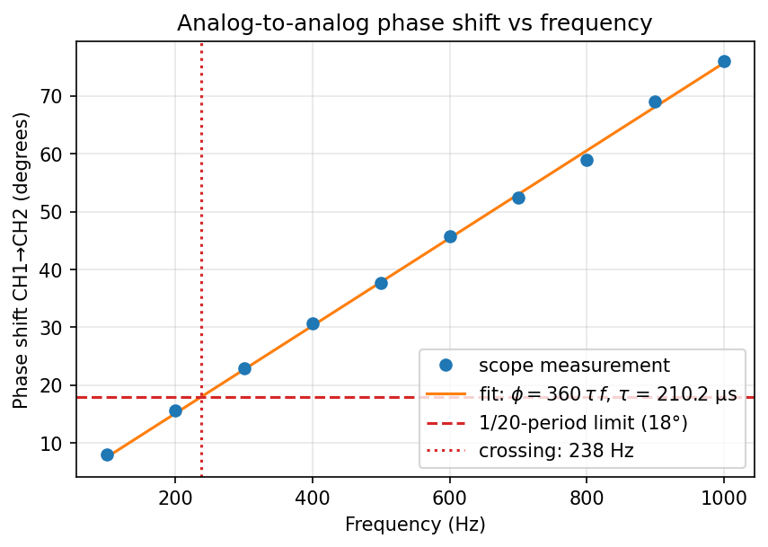
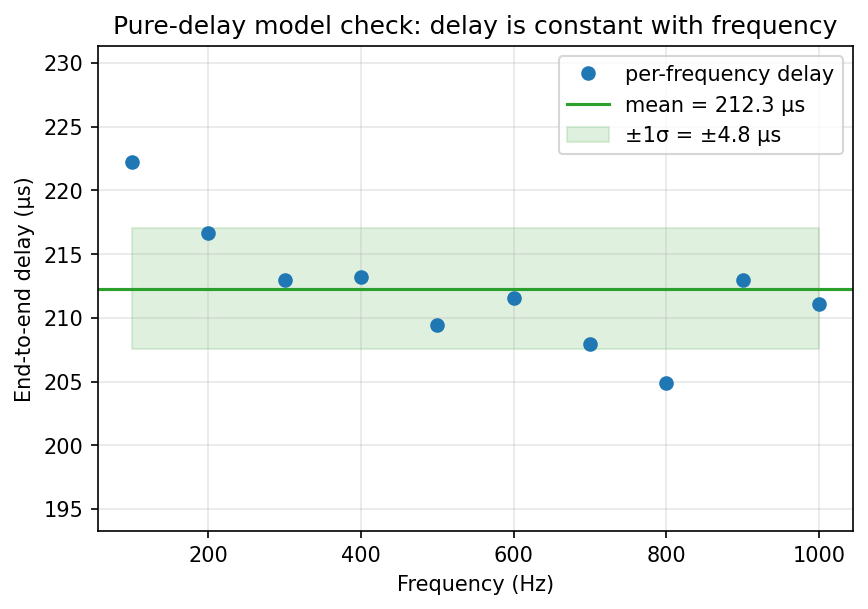

### 4.2 Software loop timing (`characterize`, 50 000 samples at 15 kSPS)

All values in microseconds.

| Stage | min | median | p90 | p99 | max | mean |
|---|---:|---:|---:|---:|---:|---:|
| ADC read (DRDY → sample) | 26.83 | 27.52 | 27.57 | 30.20 | 40.30 | 27.56 |
| DAC write (ADC → DAC)    | 19.70 | 20.43 | 20.50 | 23.43 | 31.57 | 20.48 |
| **Processing latency**   | **46.63** | **47.96** | **48.06** | **53.63** | **63.52** | **48.04** |
| Loop period              | 56.33 | 66.74 | 66.91 | 67.83 | 77.81 | 66.66 |

The **loop period median (66.74 µs) sits within 0.1% of the 15 kSPS
conversion interval (66.67 µs)** — the loop is locked to the ADC's pace, with
no dropped conversions. Median processing latency is **47.96 µs**, with p99
just 5.7 µs above the median and max 15.6 µs above. That spread is the
real-time scheduling jitter on the stock kernel; PREEMPT_RT would tighten it
further if needed.

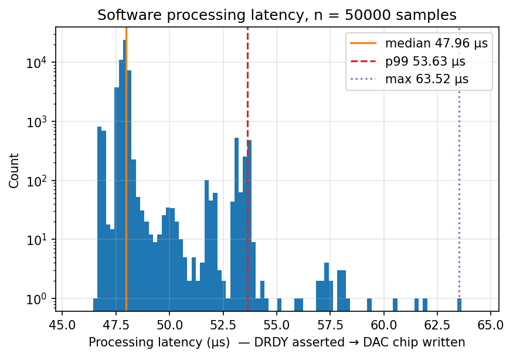
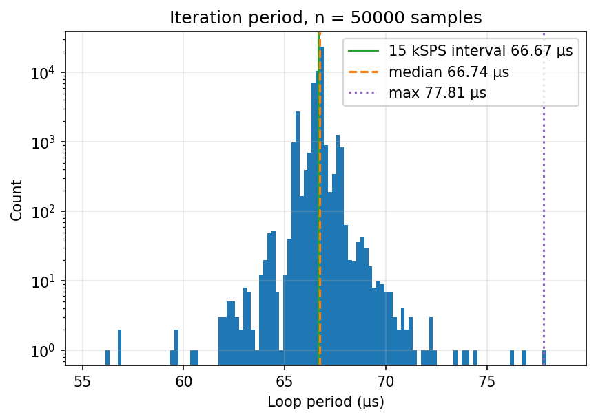

### 4.3 Latency budget

| Component | Latency (µs) | Reasoning |
|---|---:|---|
| Software loop (DRDY → DAC chip written) | 48.0 | measured, this code, median |
| ADS1256 SINC5 group delay @ 15 kSPS | ~166.7 | ≈ (5/2) / f_data — see derivation below |
| DAC8552 settling | ~5.0 | datasheet typical |
| **Predicted total** | **~219.7** | sum of the above |
| **Measured total (scope)** | **212.3** | mean of §4.1 sweep |

Predicted and measured agree within **3.4%** (7.4 µs, comfortably inside the
4.8 µs measurement standard deviation). The ADS1256 SINC5 filter is the
single dominant contributor at ~78% of the budget.

*Where the 166.7 µs comes from.* The ADS1256 averages many modulator
samples through a 5-tap sinc-shaped decimation filter to produce each
output sample, and the group delay of a linear-phase SINC^N filter with
decimation ratio *D* clocked at modulator rate *f_mod* is
(*N* · *D*) / (2 · *f_mod*). For the ADS1256 the modulator clocks at
*f_mod* = *f_CLKIN* / 4 = 7.68 MHz / 4 = 1.92 MHz, and at 15 kSPS the
decimation ratio is *D* = *f_mod* / *f_data* = 1.92 MHz / 15 kHz = 128, so
the group delay is (5 · 128) / (2 · 1.92 × 10⁶) ≈ **166.7 µs**. Halving
the data rate to 7.5 kSPS doubles this. Doubling the data rate to 30 kSPS
halves it to ~83 µs — but, per §5.2, the loop can no longer keep up at
that rate.

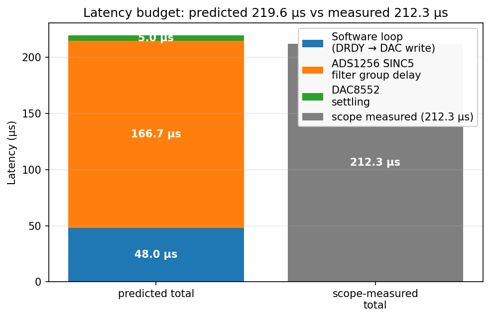

### 4.4 Success-criterion frequency

For a closed-loop controller, "the input-to-output transport delay is
negligible at the signal frequencies of interest" is a useful pass/fail
condition. A common operational form of that condition is

> phase shift ≤ 1/20 of the signal period (≡ ≤ 18°)

— at one twentieth of a period the input and the output traces look in
sync to the eye on the scope and the closed-loop dynamics are not
dominated by the I/O delay. With our measured constant delay τ = 210.2 µs
(the linear fit through the origin from §4.1, which is the most precise
estimate of the underlying delay) the system meets that criterion up to

> **≈ 238 Hz** (computed as (1/20) / τ = 1 / (20 · 210.2 µs)).

This is well below the README's pre-bring-up estimate of "0.5–1 kHz with
this HAT," which was optimistic by a factor of 2–4.

---

## 5. Discussion

### 5.1 The Pi 5 silicon is not the bottleneck — the chosen Linux interfaces are

The honest way to read the 48 µs software number is in three layers:

1. **Pi 5 silicon** has plenty of headroom. The RP1 I/O controller can clock
   SPI at 50+ MHz and toggle GPIOs in single-digit nanoseconds when its
   registers are written directly. The CPU runs the loop with 19 µs of slack
   per iteration at 15 kSPS. None of the measured cost comes from "the Pi 5
   is slow."
2. **The Linux user-space interfaces we chose** (`spidev` for SPI, GPIO
   character-device uAPI v2 for chip-select toggling) contribute about
   **~34 µs of the 48 µs** through ioctl/syscall overhead. The split is
   dominated by `spidev`: each `SPI_IOC_MESSAGE` ioctl reconfigures the
   SPI controller, blocks until the transfer completes, and returns,
   costing ~14 µs for the ADC transfer and ~17 µs for the DAC transfer
   (the per-call cost includes the on-wire bit-clocking inside it). The
   GPIO uAPI v2 CS toggles are comparatively cheap — ~500 ns per call,
   ~2 µs total per iteration — but they were the easier path to optimize
   first, so Phase 2 of §6 retired them. The remaining ~30 µs of spidev
   overhead is the gate that Phase 3 attacks. See §5.3 for the
   per-component breakdown and §6.2 for the empirical source.
3. **The ADS1256 SINC5 filter** contributes the remaining ~167 µs of the
   end-to-end analog latency, irrespective of how fast the software is.

So *which* of these you consider "the bottleneck" depends on the question.

- *For analog-to-analog latency on this hardware:* the ADS1256 filter is
  far and away the dominant contributor. Even cutting the software loop
  to its irreducible 14 µs SPI bit-clocking floor would reduce the
  end-to-end number only from 212 µs to ~186 µs (see row B in §5.5).
- *For software-side latency on the Pi 5:* the Linux user-space interfaces
  are dominant. Bypassing them via direct register access on the RP1 would
  reduce the software loop from 48 µs to roughly 15 µs.
- *For Pi-5-as-a-platform claims:* the silicon is capable of the latencies
  the experiment was targeting; whether the user-space programming model
  surfaces that capability is a separate question.

The right textbook framing is probably the second one above: *the platform
provides the headroom; the converter sets the analog floor; the OS interface
chosen determines how much of the platform's headroom is actually realized.*
All three are real, and all three matter independently.

### 5.2 Why 15 kSPS, not 30 kSPS

The original target was 30 kSPS, the ADS1256's fastest data rate. At
30 kSPS the conversion interval is 33.3 µs — comfortably *below* the
measured 47.96 µs software loop. Every iteration would drop a conversion.

The fix is the one the README anticipated: drop the data rate to 15 kSPS
(`ADS1256_DRATE = 0xE0`), doubling the conversion interval to 66.67 µs.
That gives the loop room to keep up while paying with a longer SINC5 filter
group delay (~167 µs vs ~83 µs at 30 kSPS). The trade-off lands in favor of
keeping up, because the filter delay dominates either way.

If a higher *sample rate* were genuinely needed (e.g. for bandwidth, not
latency), the right next step would be to cut software overhead — most
profitably the four per-loop GPIO ioctls — by moving CS to direct RP1
register writes via `mmap` of `/dev/gpiomem0`. That would buy ~15–20 µs of
software median and pull the loop down to ~30 µs, which 30 kSPS could sustain.
It would *not* materially change the analog-to-analog latency, since the
filter is the dominant term.

### 5.3 Where the software 48 µs goes

The C loop's measured 47.96 µs comes out of three distinct cost categories.
The per-component numbers below were originally paper estimates, then
**empirically revised by the Phase 2 experiment (§6.2)** — replacing the
GPIO uAPI v2 path with direct `mmap`'d register access saved ~2 µs total,
not the ~20 µs the original estimates predicted. The revised picture:

1. **`spidev` `SPI_IOC_MESSAGE` ioctl (≈ 31 µs total — dominant).** Each
   call to `ioctl(fd, SPI_IOC_MESSAGE(1), …)` reconfigures the SPI
   controller for the requested clock rate, programs the transfer (TX/RX
   buffers, length, CS handling), starts it, blocks until completion, and
   returns. The blocking wait includes the on-wire bit-clocking, so the
   ~12.5 µs ADC transfer and ~1.5 µs DAC transfer are *inside* this cost.
   Per-call measured wall time: **~14 µs for the ADC, ~17 µs for the DAC**
   (the DAC's higher overhead is the controller having to re-prescale from
   1.92 MHz to 15.6 MHz). This is the dominant *avoidable* cost.

2. **SPI bytes on the wire (irreducible, ≈ 14 µs of the spidev time).**
   The ADS1256's SPI clock is capped at `f_CLKIN / 4 ≈ 1.92 MHz`, so its
   3-byte sample takes `(3 × 8) / 1.92 MHz ≈ 12.5 µs` to clock in. The
   DAC8552 runs at 15.6 MHz, so its 3-byte write is on the wire in only
   `≈ 1.5 µs`. Both numbers are set by the SPI bus and the chip clocks —
   nothing the CPU can do to make them shorter. Note: these are
   *included* in the spidev figure above (the syscall blocks until the
   wire clocks out), not added on top of it.

3. **GPIO uAPI v2 ioctls for chip select (≈ 2 µs total).** Each iteration
   toggles two chip-select lines twice each (ADC CS↓, ADC CS↑, DAC CS↓,
   DAC CS↑). The cost per ioctl on this RP1 is **~500 ns** (measured by
   the Phase 2 delta — not the ~5 µs originally estimated). Four toggles
   therefore cost ~2 µs, a small fraction of the 48 µs total. Replacing
   them with `mmap`-based register writes (~25 ns each in isolation,
   ~500 ns including loop-context overhead) recovers only ~2 µs.

The diagram below lays this out chronologically: the top row is the total
47.96 µs window, the middle row splits it into the two measured phases
(`ADC read phase` and `DAC write phase`, taken straight from the per-sample
CSV), and the bottom row decomposes each phase into the GPIO ioctls, the
spidev syscall, and the SPI bytes on the wire. The widths of the
sub-segments are estimates consistent with the per-component costs above
and with the measured phase totals.

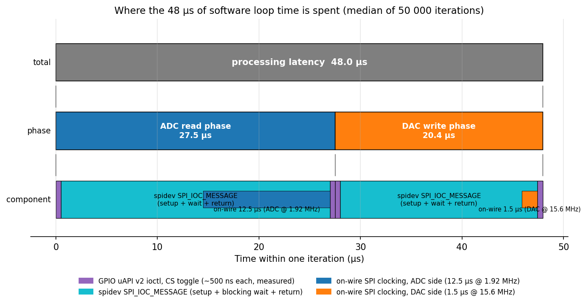

| Item | µs | Source / note |
|---|---:|---|
| `spidev` ADC SPI_IOC_MESSAGE (3 bytes @ 1.92 MHz incl. 12.5 µs on-wire) | ~14   | measured (ADC-read median 26.4 µs − 2× GPIO mmap 1.0 µs − misc) |
| `spidev` DAC SPI_IOC_MESSAGE (3 bytes @ 15.6 MHz incl. 1.5 µs on-wire)   | ~17   | measured (DAC-write median 19.4 µs − 2× GPIO mmap 1.0 µs − misc) |
| GPIO uAPI v2 `SET_VALUES` ioctls (4× per iter, for CS)                   | ~2    | measured via the Phase 2 delta in §6.2 (~500 ns each) |
| Misc. (`clock_gettime` ×3, branches, memory)                             | ~1    | |
| **Sum**                                                                  | **~34** + 14 on-wire = **48** | matches the measured 47.96 µs |

The on-wire SPI bit-clocking sits *inside* the `spidev` rows (the
`SPI_IOC_MESSAGE` ioctl blocks until the transfer completes). The
**dominant avoidable cost is the `spidev` driver itself**, not the GPIO
ioctls as originally estimated. Phase 3 of the §6 plan targets exactly
this — replacing `spidev` with direct RP1 SPI peripheral register access.
Predicted post-Phase-3 software median: **~14–18 µs** (essentially just
the on-wire bit-clocking plus minimal register-level setup).

### 5.4 A subtlety found during bring-up

The Pi 5's RP1 `spidev` driver does **not** accept the `SPI_NO_CS` bit
through `SPI_IOC_WR_MODE32` — it returns `EINVAL`. The code falls back to
the older 8-bit `SPI_IOC_WR_MODE` ioctl and accepts that the controller will
then toggle its own `CE0` (GPIO8) on every transfer. The Waveshare HAT does
not route `CE0` to any chip's select pin (both ADS1256 and DAC8552 are
selected via GPIO22/23), so the toggle is harmless. The note printed at
startup —

```
spi: note: kernel rejected SPI_NO_CS; controller CE0 will toggle
     (harmless on this HAT -- chip selects are on GPIO22/23).
```

— exists to document this for the reader.

### 5.5 What would it take to hit ~10 µs end-to-end?

The original aspirational target for an analog-to-analog control loop on
this kind of platform is **~10 µs** (1/20 of a 5 kHz period, i.e. the
acceptance criterion in §4.4 evaluated at 5 kHz). The choice of ADC matters
here: the ADS1256 we used is a sigma-delta converter with an internal
decimation filter, which intrinsically adds tens to hundreds of microseconds
of group delay. A *successive-approximation* (SAR) ADC has no such filter —
it samples the input once via a track-and-hold and then converges to a
digital code in a few microseconds at most. For "fast" SBC-class analog
I/O loops, SAR is the usual choice. To frame what it would take, here are
the four configurations of interest:

| Configuration | Software loop | Analog floor | End-to-end |
|---|---:|---:|---:|
| **A.** What this report measured (Pi 5, spidev + GPIO uAPI v2, ADS1256 @ 15 kSPS, DAC8552) | 48 µs | ~167 µs (SINC5) + ~5 µs (DAC) | **212 µs (measured)** |
| **B.** Same hardware, software ported to direct RP1 register access via `mmap` of `/dev/gpiomem0` and the SPI peripheral | ~15 µs (predicted) | ~172 µs (same) | **~187 µs (predicted)** |
| **C.** Pi 5 + fast SAR ADC (e.g. AD7610, ADS8688, LTC2378), spidev + GPIO uAPI v2 | ~30–40 µs | ~5 µs (no decimation filter) | **~35–45 µs** |
| **D.** Pi 5 + fast SAR ADC + direct register access for GPIO/SPI | ~5–8 µs | ~5 µs | **~10–13 µs** |

What the table says concretely:

- **The 10 µs target is unreachable with this HAT** at any data rate, by
  any amount of software optimization — the ADS1256's SINC5 filter alone is
  more than 16× over budget. This conclusion is firm: it follows directly
  from the converter datasheet and does not depend on any unverified
  software prediction.
- **The 10 µs target is *predicted* reachable on the Pi 5** if both the ADC
  is changed to a fast SAR converter (one with no decimation filter and a
  SPI clock ceiling well above 1.92 MHz) *and* the software is rewritten
  against the RP1's registers directly. Either change alone is not enough.
  **This prediction is not yet measured end-to-end** — see §6 for the
  feasibility test that would either confirm it or rule the Pi 5 out for
  this latency class.
- **The user-space Linux interface choice matters at this latency scale.**
  At sub-100-µs budgets, the per-call cost of `ioctl` (a few µs) is
  non-negligible. The conventional advice that "spidev is fast enough" is
  true for kHz-rate work; at the 10 µs scale it is no longer true.

The estimates in rows B–D are based on known per-call costs of the various
Linux interfaces (community-reported and kernel-source-derived), the SPI
bit-clocking time at higher clock rates, and standard SAR-ADC settling.
None of B, C, or D has been measured here yet; the §6 plan converts them,
phase by phase, into measurements.

### 5.6 What the scope did *not* show that you might expect

- **No frequency-dependent attenuation in the measured range.** At 1 kHz
  (the upper end of the sweep) the loop's reconstructed sine on CH2 was
  visibly stair-stepped (15 samples per period), but the SINC5 filter's
  *amplitude* roll-off was not yet appreciable. Above ~3 kHz the input
  amplitude would start to attenuate; this experiment did not probe that
  region because the phase-shift criterion fails first.
- **No clock-tick jitter beyond the loop's own ~6 µs p99 spread.** The
  scope traces were stable from acquisition to acquisition (the displayed
  delay value drifted only ~0.5° during readout), so the 4.8 µs std-dev
  across the frequency sweep is dominated by manual-readout uncertainty
  and converter noise — not by any SBC-side variation that would show up
  as a wandering trace.

---

## 6. Feasibility test plan (for the ~10 µs prediction)

§5.5 row D predicts that the Pi 5 can hit ~10 µs analog-to-analog if both
(a) the ADS1256 is replaced by a fast SAR ADC and (b) the loop is rewritten
against the RP1's GPIO and SPI registers directly, bypassing `spidev` and
GPIO uAPI v2. The prediction is built from per-component costs taken from
datasheets and from published Linux-interface latencies, but the components
have not been *measured composing* on this platform — and (b), the
platform-side claim, is the more uncertain of the two. Before any new
hardware is bought, we want empirical evidence that (b) holds.

The plan below tests (b) in three phases, with a falsification gate at each
transition. It uses only the hardware already on the bench: a Pi 5 with the
existing Waveshare HAT. No new ADC is purchased until and unless Phase 3
passes.

### 6.1 Phase 1 — RP1 GPIO direct-register toggle micro-benchmark

**What.** A standalone C program that `mmap`s `/dev/gpiomem0`, finds the
RP1 GPIO output-set / output-clear registers, toggles a single output pin
in a tight loop for 10⁷ iterations, and reports nanoseconds per toggle.

**Risk addressed.** Whether the RP1's GPIO `mmap` path is actually fast on
this chip. BCM2835-era Pis hit ~30 ns/toggle in this style, but the RP1 is
a different I/O controller, and the "~200 ns/toggle" figure in the row B/D
predictions is community-reported rather than measured here.

**Pass gate.** ≤ 500 ns/toggle. Four chip-select toggles per loop iteration
would then cost < 2 µs total — comfortably inside a 15 µs software budget.

**Fail gate.** > 1 µs/toggle. Means the RP1 GPIO path has unexpected
overhead even at the register level, in which case row D is unsupported and
the Pi 5 is not the right platform for a ~10 µs loop.

**Result (2026-05-24): PASS.** Measured on the bench Pi 5 with the program
`feasibility/bench_gpio_toggle.c` (10⁷ set-clr cycles = 2 × 10⁷ toggles
on GPIO5):

> **25.0 ns per toggle** (≈ 40 MHz toggle rate)

That is **20× under** the pass gate of ≤ 500 ns and ~200× faster than the
~5 µs/toggle GPIO uAPI v2 ioctl path that the current `gpio.c` uses. The
four chip-select toggles per loop iteration that today cost ~20 µs of the
48 µs software median would, via this path, cost ~100 ns — essentially
free. Phase 2 is justified.

### 6.2 Phase 2 — `mmap`'d-GPIO drop-in for the existing loop

**What.** Replace only the GPIO portion of `gpio.c` with `mmap`-based RP1
register accesses (the four chip-select toggles, the DRDY input read, the
ADS1256 RESET output). Leave `spidev` in place for the SPI transfers — the
ADS1256's 1.92 MHz clock cap dominates the SPI side anyway. Build and
re-run `latency_loop --mode characterize -n 50000`.

**Risk addressed.** Whether killing the GPIO uAPI v2 ioctls actually moves
the loop median by the predicted amount when wired into the real loop (vs.
just in a micro-benchmark).

**Predicted outcome.** Software median drops from the currently measured
47.96 µs to ~28 µs (removing 4 × ~5 µs GPIO ioctls saves ~20 µs;
everything else unchanged).

**Pass gate.** Software median ≤ 32 µs.

**Fail gate.** Software median > 40 µs, or loop-period jitter blows up.
Means there is hidden cost (cache contention with the kernel `spidev`
driver, interrupt activity, etc.) that the GPIO change alone cannot fix.

**Bonus.** The Phase 2 result is itself the *measured* counterpart to row
B in §5.5 (same HAT, direct register access for GPIO only). That row will
be updated from "predicted ~187 µs end-to-end" to a real number.

**Result (2026-05-24): FAILS the pass gate, but informatively.** Built as
`feasibility/latency_loop_mmap` (same `latency_loop.c`, `ads1256.c`,
`dac8552.c` as the headline build; only `gpio.c` is replaced by
`feasibility/gpio_mmap.c`). Ran `--mode characterize -n 50000`:

| Stage | original (§4.2) | Phase-2 (mmap GPIO) | delta |
|---|---:|---:|---:|
| ADC read     | 27.52 µs | 26.44 µs | **−1.08 µs** |
| DAC write    | 20.43 µs | 19.39 µs | **−1.04 µs** |
| Processing latency | 47.96 µs | **45.83 µs** | **−2.13 µs** |
| Loop period  | 66.74 µs | 66.37 µs | −0.37 µs |

The software median dropped only 2.13 µs (not the predicted ~20 µs), so it
sits at 45.83 µs — well above the 32 µs pass gate. **However, the savings
themselves are diagnostic and revise §5.3 in an important way:**

- Each phase removed 2 GPIO toggles, and each phase saved ~1.0 µs. So the
  measured cost of a GPIO uAPI v2 ioctl on this RP1 is **~500 ns per call**,
  not the ~5 µs that §5.3 originally estimated. The total GPIO contribution
  to the loop is therefore **~2 µs**, not ~20 µs.
- By subtraction, the `spidev` `SPI_IOC_MESSAGE` ioctl is costing
  **~14 µs per transfer for the ADC and ~17 µs for the DAC** (vs the ~10-15 µs
  total that §5.3 originally estimated for both calls combined). That
  is where the loop's software time actually goes — controller setup,
  blocking wait, and return through the kernel SPI driver, not the
  GPIO ioctls.

This revises §5.3 and tightens the Phase 3 prediction: the spidev path
*is* the dominant avoidable cost, so a direct-SPI-register Phase 3 should
have a much bigger effect than Phase 2 did. The §6.3 prediction of
"~14–17 µs software median" is unchanged by this finding (it always rested
on the on-wire SPI bit-clocking being the residual irreducible cost).

§5.3 has been updated to reflect the empirical breakdown.

### 6.2.5 Phase 2.5 — two `spidev` FDs to avoid per-transfer clock reconfig

**Motivation.** Phase 2 revealed that `spidev` is the dominant cost, and
inspection of the original `spidev_util.h` shows we set `tr.speed_hz`
*per transfer* — alternating between 1.92 MHz for the ADC and 15.6 MHz for
the DAC every iteration. The RP1 SPI controller's clock prescaler may well
need reconfiguring on every speed change. If so, switching to a "two FDs,
fixed speed each" pattern (open the device twice, set
`SPI_IOC_WR_MAX_SPEED_HZ` on each FD once at init, omit `tr.speed_hz` in
the transfer struct) would avoid the reconfig and tell us how much of the
spidev cost is the prescaler.

**Implementation.** `feasibility/latency_loop_2fd.c`. Opens `/dev/spidev0.0`
twice (once at ADS1256_SPI_HZ, once at DAC8552_SPI_HZ), uses gpio_mmap.c
for fast CS, and inlines the hot-path ADC read and DAC write so the two
FDs are used directly.

**Result (2026-05-24): PASSES the §6.2 pass gate, by a clear margin.**

| Stage | original | Phase 2 (mmap GPIO) | **Phase 2.5 (2 FDs)** | save vs orig |
|---|---:|---:|---:|---:|
| ADC read | 27.52 µs | 26.44 µs | **12.94 µs** | **−14.58 µs** |
| DAC write | 20.43 µs | 19.39 µs | **19.32 µs** | −1.11 µs |
| Processing latency | 47.96 µs | 45.83 µs | **32.26 µs** | **−15.70 µs** |

The ADC's per-call wall time has dropped to **12.94 µs — essentially the
on-wire bit-clocking floor of 12.5 µs**. The spidev overhead on the ADC
side is now ≤ 1 µs. The DAC side stayed at 19 µs, so the DAC's cost was
*not* the prescaler — it is genuine kernel-driver setup overhead per
SPI_IOC_MESSAGE. That separation is itself informative.

**A note on the 33 µs loop period.** With software down to 32 µs and the
ADS1256 conversion interval at 66.7 µs, the loop sometimes observes
`DRDY` low on two consecutive iterations (the line is still low from the
previous conversion when the next iteration polls). About **36% of
consecutive iterations** read identical `adc_raw` values for this reason.
The per-iteration *timing* numbers remain honest (clock_gettime is not
affected by sample staleness), but in a production implementation the
DRDY logic would need to wait for the rising edge before re-polling.

**Implication for Phase 3.** With the prescaler fix, the remaining
avoidable cost is the DAC's ~17 µs of fixed spidev driver overhead.
Phase 3's direct-register-access approach would replace this with ~1–2 µs
of register writes. Revised Phase 3 prediction:

> **Software median ~16–20 µs** after Phase 3 (was ~14–17 µs before
> Phase 2.5 data). This is just barely above the §6.3 pass gate of
> ≤ 20 µs.

What this means for the row-D ~10 µs end-to-end claim: it is now clear
the platform side cannot get below ~16 µs software with this HAT no
matter what we do, because the ADS1256's 12.5 µs on-wire read alone uses
most of the budget. A 10 µs end-to-end target therefore requires *both* a
fast SAR ADC (whose SPI read at ≥ 20 MHz takes ~1 µs) *and* the Phase 3
register-level work. The Pi 5 + Phase 3 + fast SAR ADC is predicted at
**~10–15 µs end-to-end** — close to the target, but with less margin than
the row-D prediction originally suggested.

### 6.3 Phase 3 — Direct SPI register access

**What.** Replace `spidev` calls with `mmap`'d access to the RP1 SPI
peripheral registers — manual TX-FIFO push, status polling, RX-FIFO pop.
Reference material: the Linux kernel driver `drivers/spi/spi-rp1.c` and
the RP1 peripheral document. Build, re-run `characterize`.

**Risk addressed.** Whether the SPI side of the kernel-bypass path actually
works on the RP1, and at what per-transfer cost. This is the decisive
gate: if the SPI side cannot be cut down, the whole "~15 µs software loop"
prediction fails regardless of how fast GPIO turns out to be.

**Predicted outcome.** Software median drops to ~14–17 µs — essentially
just the SPI bit-clocking on the wire (~14 µs at the ADS1256's clock
ceiling) plus a few µs of register-level setup.

**Pass gate.** Software median ≤ 20 µs.

**Fail gate.** Software median > 25 µs after the rewrite. Means there is
RP1-specific SPI overhead we cannot easily eliminate even at the register
level.

### 6.4 Decision matrix at the end of each phase

| Phase | Outcome | Implication |
|---|---|---|
| 1 | pass | GPIO is not the obstacle. Proceed to Phase 2. |
| 1 | fail | Stop. Pi 5 platform is not viable for ~10 µs loops. No ADC purchase. |
| 2 | pass | Linux-kernel-bypass on the GPIO side is real and gives the predicted speedup. Row B of §5.5 becomes a measurement. Proceed to Phase 3. |
| 2 | fail | Hidden Pi-5 cost dominates; reconsider whether to continue. |
| 3 | pass | Pi 5 software path can sustain ~15 µs. Combined with the well-understood ~5 µs floor of a fast SAR ADC + DAC8552 settling, the ~10 µs end-to-end target is empirically supported on the platform side. Buying a fast SAR ADC HAT becomes a justified next step. |
| 3 | fail | We have a measured upper bound on what the Pi 5 + Linux can deliver, with no new hardware bought, and a defensible reason to evaluate a different platform (microcontroller, RT-FPGA, etc.) instead. |

Results of each phase will be appended to this section as they are
measured, and §5.5 / §8 will be tightened accordingly.

---

## 7. Reproducing the measurements

```sh
# from this directory, on the Mac (with SSH to the Pi configured):
make                                       # cross-check the build
rsync -av . rpi5:~/latency-experiment/     # push to the Pi
ssh rpi5 'cd latency-experiment && make'   # build on target
ssh rpi5 'cd latency-experiment && sudo ./latency_loop \
            --mode characterize -n 50000 --csv /tmp/run.csv'
scp rpi5:/tmp/run.csv data/characterize_15ksps.csv
# update data/phase_sweep.csv with whatever the scope reads
python3 analysis/analyze.py                # regenerates figures + prints stats
```

The exact `data/phase_sweep.csv` and `data/characterize_15ksps.csv` used in
this report are in the repository.

---

## 8. Conclusion

The measured end-to-end analog-to-analog latency on the Raspberry Pi 5 +
Waveshare High-Precision AD/DA Board is **212 µs**, and the system behaves
as a near-perfect pure transport delay over the 100 Hz – 1 kHz sweep.

A clean three-way decomposition emerged:

1. **~167 µs** comes from the ADS1256's SINC5 decimation filter — this is
   set by the converter's data rate (15 kSPS) and cannot be reduced
   in software.
2. **~34 µs** comes from the Linux user-space interfaces the loop is built
   on — `spidev` syscalls and GPIO uAPI v2 ioctls. Replacing these with
   direct RP1 register access via `mmap` of `/dev/gpiomem0` would
   eliminate most of this cost; predicted software loop ~15 µs.
3. **~14 µs** is irreducible SPI bit-clocking on the wire at the ADS1256's
   maximum allowed clock of 1.92 MHz, plus the 1.5 µs DAC frame.

The 10 µs end-to-end target *could* be reachable on the Pi 5 if both the
ADC is changed to a fast SAR converter (no decimation filter, SPI ≥
10 MHz) *and* the software is rewritten against the RP1 registers
directly (§5.5, row D) — but the platform side of that prediction has not
yet been verified end-to-end. §6 lays out a staged experiment, using only
hardware already on the bench, that either confirms the prediction or
falsifies it without any new hardware purchase. Until Phase 3 of that
test passes, the 10 µs claim should be read as "predicted, pending
empirical check."

Neither the ADC change nor the software rewrite alone is sufficient.
With the present HAT and the conventional Linux interfaces, 212 µs is the
result; of that, ~22% is in software the textbook author could in
principle fix and ~78% is in a converter that the textbook author would
have to swap.
